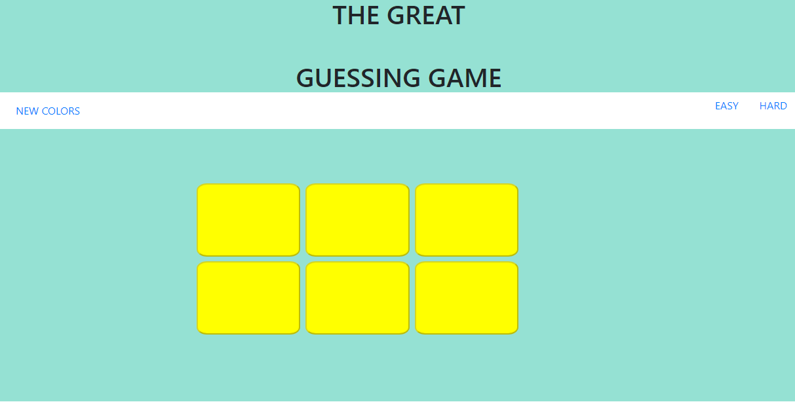
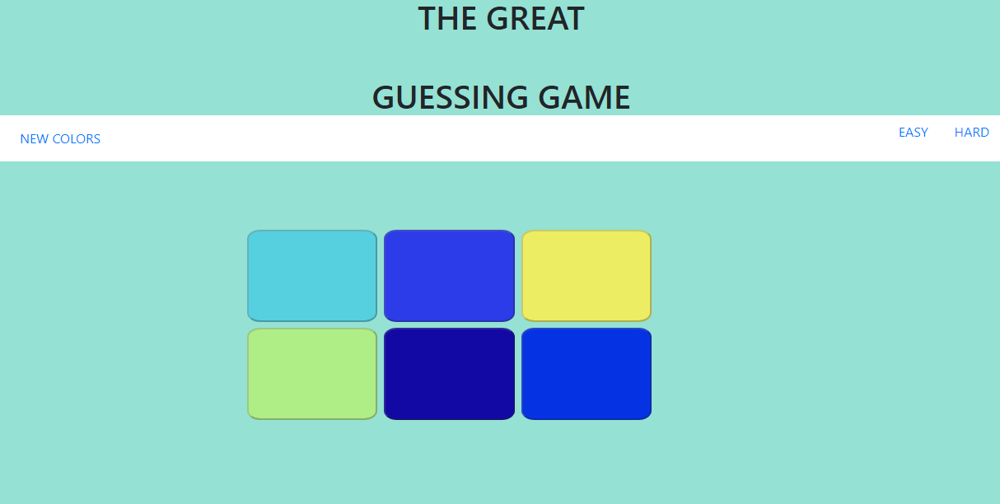
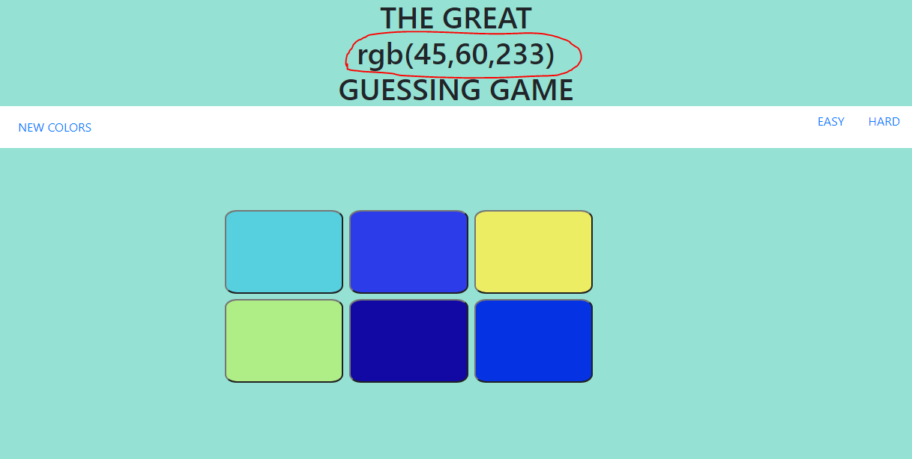

<h1>Guess color game</h1>
  
this is a simple guessing color game for practicing my basic React.js skill

  

  
there is a navbar settle by Bootstrap, Because I am more familiar with Bootstrap
    rather than MUI. However I still read the documentation of MUI

  

  <h4>There are three button for us to press on the navbar</h4>
  <ul>
    <li>New Color</li>
    <ul>
      <li>initial all the color button are yellow</li>
      <li>after press the New Color, It will generate different colors for hard and easy mode</li>
    </ul>
    <li>Hard</li>
    <ul>
      <li>This stands for Hard mode and there will be six different colors on the board</li>
      <li>In the same time, it makes all the color button able to click</li>
    </ul>
    <li>Easy</li>
    <ul>
      <li>This stands for Easy mode and there will be three different colors on the board</li>
      <li>In the same time, it makes all the color button able to click</li>
    </ul>
  </ul>
  

  
After we choose the mode the title part will show the rgb value which is our answer
    and we choose a color button it will change the board to show you if you are right or wrong

  

  <ul>
    <li>initial</li>
    <li></li>
    <li>press new color</li>
    <li></li>
    <li>choose hard mode</li>
    <li></li>
    <li>press a color and the result</li>
    <li></li>
  </ul>
